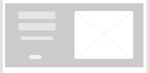

*** Assignment 6 ***

# Wireframe for Online Grocery Store 

*** Note : Representation in Wireframe***
### Image

## 1. Home Page
    In this page all the information of the page is included. Sliders, product view and all the features are present.

### a. Slider 
Current Product are shwom in silder. 

### b. Top product Deal of the day and top company 
Deal of the day showing

### c. Second Slider
Current Product are shown in silder. 

### d. Footer
Footer with three section

## 2. Contact Us

## 3. Login

## 4. Billing

## 5. Product display Layout coulmn 

## 6. Product display Layout gird 

## 7. Registration

## 8. Products

## 9. Ads

